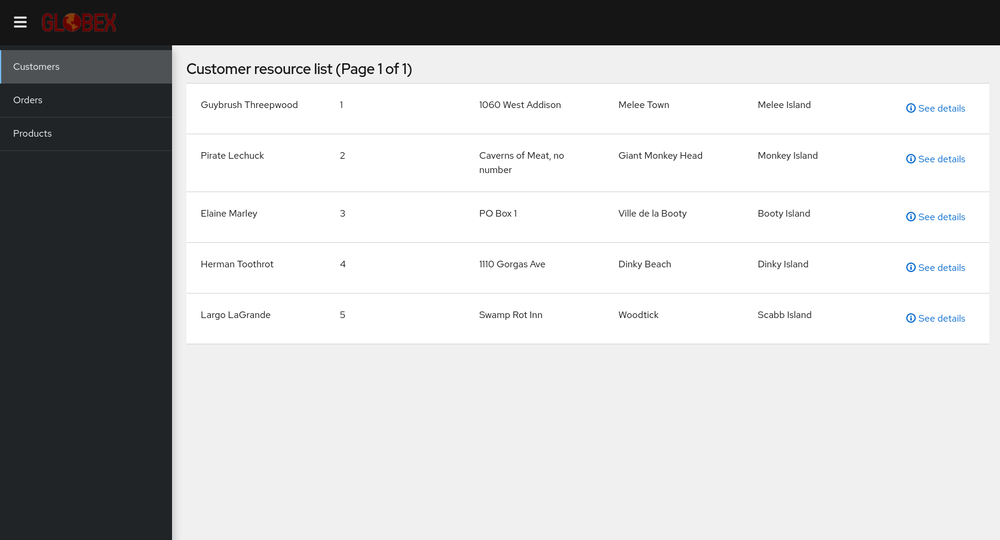

# Application Modernization and Migration enablement: Konveyor End to End demo application


## Architecture

The demo includes the following services:

- **Customers**: The original Retail application from which the rest of microservices have been carved out. It still retains the business logic related to customer management. This legacy application runs on Tomcat and uses an Oracle database.
- **Inventory**: Stores detailed information about products. Developed using Quarkus and PostgreSQL as data store. This service has been configured with the the JDK build mode for Quarkus by default.
- **Orders**: Manages all order related entities. It stores only UIDs to refer to Products and Customers. Implemented with Spring Boot and using a PostgreSQL database.
- **Gateway**: Access and aggregation layer for the whole application. It gets orders data and aggregates Products and Customers detailed information. Also implemented with the Spring Boot/PostgreSQL stack.
- **Frontend**: A new front end layer developed with the React flavor of Patternfly, published on Nginx.


It can be argued that the domain is too fine grained for the modeled business, or that the approach is not optimal for data aggregation. While these statements might be true, the focus on the demo was to present a simple case with microservices interacting with each other, and shouldn't be considered a design aimed for a production solution.

## Workshop instructions

[Click here](workshop.md) for instructions to deploy this demo as part of the Modern Application Development workshop

## OpenShift deployment instructions

This demo has been developed using the following setup:

- OpenShift Container Platform 4.12
- Red Hat OpenShift Pipelines Operator 1.6.2 (Tekton 0.28.3)

## Manual deployment in OCP

Create a coolstore project

Install pipelines operator

`oc new-project coolstore`
### Deploy customers service

Deploy postgresql for customers service

`oc new-app \
    --name="customers-db" \
    -e POSTGRESQL_USER=customers \
    -e POSTGRESQL_PASSWORD=customers \
    -e POSTGRESQL_DATABASE=customers \
     --image-stream="openshift/postgresql:13-el7"`

Run `helm install -f helm/customers-tomcat-ocp/values.yaml customers helm/customers-tomcat-ocp/`

run `oc apply -f ./ocp-deploy/customers-pipeline-run.yaml`

## deploy order service

`oc new-app \
    --name="postgresql-orders" \
    -e POSTGRESQL_USER=orders \
    -e POSTGRESQL_PASSWORD=orders \
    -e POSTGRESQL_DATABASE=orders \
     --image-stream="openshift/postgresql:13-el7"`

Run `helm install -f helm/orders/values.yaml orders helm/orders/`
     
## deploy inventory service

`oc new-app \
    --name="postgresql-inventory" \
    -e POSTGRESQL_USER=inventory \
    -e POSTGRESQL_PASSWORD=inventory \
    -e POSTGRESQL_DATABASE=inventory \
     --image-stream="openshift/postgresql:13-el7"`

     Run `helm install -f helm/inventory/values.yaml inventory helm/inventory/`

## deploy gateway service

Run `helm install -f helm/gateway/values.yaml gateway helm/gateway/`
       
## deploy frontend service

Run `helm install -f helm/frontend/values.yaml frontend helm/frontend/`

## Accessing the front-end

Click on the external link from the ordersfrontend deployment.  You will see a ui as shown below:



## Running Locally

Applications can also run locally for testing purposes. In this case, the command to be used varies between Spring Boot and Quarkus. In the first case, the command is as follows:

```
mvn clean spring-boot:run -P local
```

For Quarkus services, the command is the following:

```
./mvnw compile quarkus:dev -P local
```

The Tomcat application will require a local Tomcat instance.

## Known issues

### SQLFeatureNotSupportedException exception at startup

The following exception is displayed at startup for the Orders service:

```
java.sql.SQLFeatureNotSupportedException: Method org.postgresql.jdbc.PgConnection.createClob() is not yet implemented.
```

This is caused by [an issue in Hibernate that has been fixed in version 5.4.x](https://hibernate.atlassian.net/browse/HHH-12368). Since the Hibernate version used for the Orders service is 5.3.14, a warning is displayed including the full stack trace for this exception. Although annoying, this warning is harmless for this example and can be ignored.
